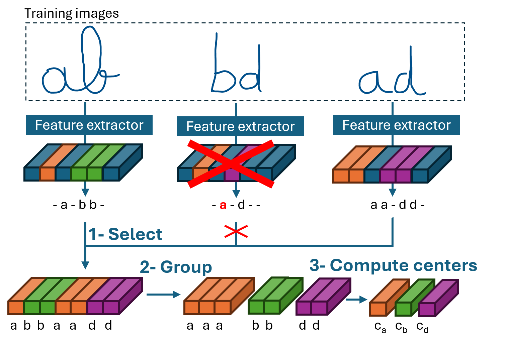

# Official code for the paper "Applying Center Loss to Neural Networks for Sequence Prediction: A Study for Handwriting Recognition" - IJCNN 2025.

Authors: Simon Corbillé, Elisa H. Barney Smith

Machine learning team from Luleå University of Technology



>Abstract: We propose a method to improve the overall accuracy of a neural network for predicting a sequence without using more training data nor adding more parameters.
We apply a center loss at the sequence level as an auxiliary task. At every epoch we compute the center for each class, then we apply a center loss on each element of the sequence in order to reduce the intra-class distance. Center loss makes features more discriminative as well as compact in the feature space which increases the accuracy of the network and reduces overfitting. The network is trained jointly with the sequence prediction task and the center loss auxiliary task which increases the computation time only during training not in inference. We evaluate our method in a handwriting text recognition context on seven datasets. In addition to outperforming methods that do not use additional data for all datasets, our method achieves competitive results compared to those that do, with faster inference speed and fewer parameters. We also show that our method applied on a light neural network improves accuracy and is able to achieve competitive performance compared to deeper models. The advantage of using a light model is the processing speed needed for real applications.

## Installation
Code test with:
* Python 3.11
* albumentations 1.4.15
* albucore 0.016
* numpy==2.2.1

```
pip install -r requirements.txt
```

For GPU: install Pytorch for GPU

## Data
### Format dataset

|              | Download link | Python file format |
| -------------| -------------| ------------- |
| IAM          | [Link](https://fki.tic.heia-fr.ch/databases/iam-handwriting-database) | src/data/format/format_iam.py  |
| Cipher T1    | [Link](https://rrc.cvc.uab.es/?ch=27&com=downloads) 		  | src/data/format/format_ciphers.py  |
| Cipher T2A   | [Link](https://rrc.cvc.uab.es/?ch=27&com=downloads)  		  | src/data/format/format_ciphers.py  |
| Cipher T2B   | [Link](https://rrc.cvc.uab.es/?ch=27&com=downloads)  		  | src/data/format/format_ciphers.py  |
| Cipher T3A   | [Link](https://rrc.cvc.uab.es/?ch=27&com=downloads) 		  | src/data/format/format_ciphers.py  |
| Cipher T3B   | [Link](https://rrc.cvc.uab.es/?ch=27&com=downloads) 		  | src/data/format/format_ciphers.py  |
| NorHand v1   | [Link](https://zenodo.org/records/6542056) 		  | Already formatted  |

### Images size

|              | Image height max | Image width max|
| -------------| -------------| ------------- |
| IAM          | 128          | 1700  |
| Cipher T1    | 120 		  | 1900  |
| Cipher T2A   | 96  		  | 768   |
| Cipher T2B   | 190  		  | 2100  |
| Cipher T3A   | 84 		  | 1120  |
| Cipher T3B   | 190 		  | 2256  |
| NorHand v1   | 200  		  | 2256  |

### Example config file (.json)

cf. directory configuration

### Text format

IAM, Norhand: text

	--read_txt_format "RAW" 
	--filter_txt "NO" 
	--compute_wer 1 
	--use_wer_formula_for_cer 0 
	--space_value "RAW" 
	
Cipher DBs: class labels are separated by space character

	--read_txt_format "CLASSES_SPACED_WITH_SPACE" 
	--filter_txt "CLEAR_TEXT" 
	--compute_wer 0 
	--use_wer_formula_for_cer 1 
	--space_value "TEXT" 
	


## Train

src/train/train_crnn.py

Need 2 parameters:
* configuration file cf. example
* log directory

example:
```
python src/train/train_crnn.py configuration/config_cpu_demo_iam.json logs
```


## Evaluate
src/evaluate/evaluate_crnn.py

Parameters:
* config file like for training
* --path_model path model trained, model trained and IAM in directory "model_pretrained"

<br/>
<br/>
Performance IAM line level model in directory "model_pretrained"

Validation:
CER: 2.58% WER: 10.80% 

Test:
CER: 3.85% WER: 14.57% 

## Reference
CRNN from "Best Practices for a Handwritten Text Recognition System"

Git: https://github.com/georgeretsi/HTR-best-practices/

Article: https://arxiv.org/abs/2404.11339

## Citation
If you find this work useful, please consider citing:
```
@inproceedings{corbille2025,
  title={Applying Center Loss to Neural Networks for Sequence Prediction: A Study for Handwriting Recognition},
  author={Simon Corbillé, Elisa H. Barney Smith},
  booktitle={to do},
  pages={to do},
  year={2025},
  organization={to do}
}
```